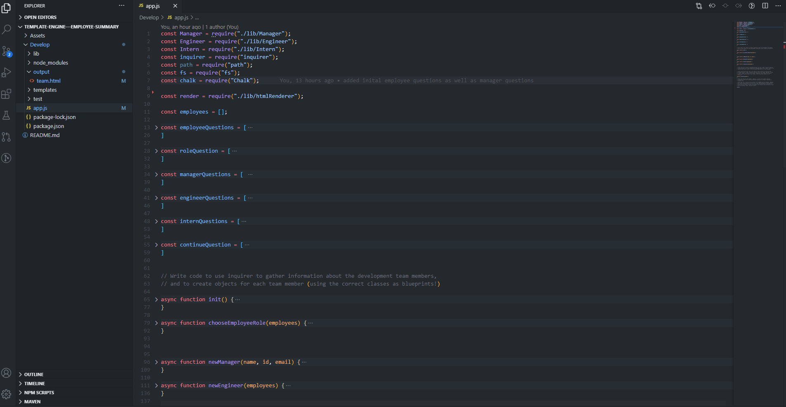
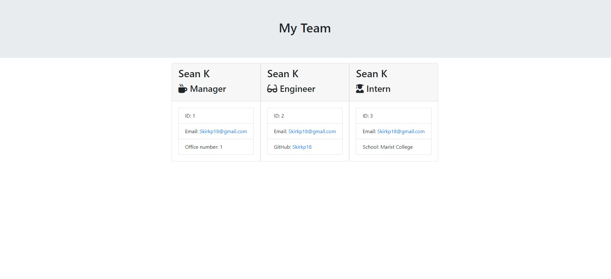

# Template-Engine---Employee-Summary

   



## Description
This program creates an HTML page that shows a users info as well as their teams info. The program will prompt user to create a manager. It will the prompt the user to choose the role of the employee under the manager as well as the employees information. You can then add more employee's or finish. When finished entering employees, the program generates an HTML page with the team as well as the teams information (role, name, etc.).
## Table of Contents 
  - [Installation](#installation)
  - [Usage](#usage)
  - [Contributing](#contributing)
  - [Tests](#tests)
  - [Questions](#questions)
  - [License](#license)
## Installation
To install necessary dependencies, run the following command:
``` 
npm i or npm install
```
## Usage
Start the program, by running the app.js file using node.js. Enter information when asked. Once finished, HTML is generated as placed in the "output" folder.


## Contributing
N/A
## Tests
To run tests, run the following command:
```
npm test "file name"
```
## Questions
If you have any questions about the repo, open an issue or contact me directly at Skirkp18@gmail.com. You can find more of my work on [GitHub](https://github.com/Skirkp18).
## License
MIT License

Copyright (c) 2020 Skirkp18

Permission is hereby granted, free of charge, to any person obtaining a copy
of this software and associated documentation files (the "Software"), to deal
in the Software without restriction, including without limitation the rights
to use, copy, modify, merge, publish, distribute, sublicense, and/or sell
copies of the Software, and to permit persons to whom the Software is
furnished to do so, subject to the following conditions:

The above copyright notice and this permission notice shall be included in all
copies or substantial portions of the Software.

THE SOFTWARE IS PROVIDED "AS IS", WITHOUT WARRANTY OF ANY KIND, EXPRESS OR
IMPLIED, INCLUDING BUT NOT LIMITED TO THE WARRANTIES OF MERCHANTABILITY,
FITNESS FOR A PARTICULAR PURPOSE AND NONINFRINGEMENT. IN NO EVENT SHALL THE
AUTHORS OR COPYRIGHT HOLDERS BE LIABLE FOR ANY CLAIM, DAMAGES OR OTHER
LIABILITY, WHETHER IN AN ACTION OF CONTRACT, TORT OR OTHERWISE, ARISING FROM,
OUT OF OR IN CONNECTION WITH THE SOFTWARE OR THE USE OR OTHER DEALINGS IN THE
SOFTWARE.
